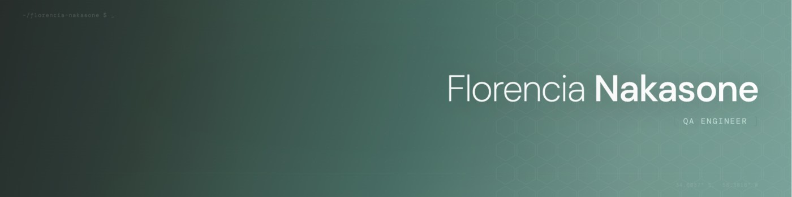

<h1 align="center">Hola! Soy Flor 👋</h1>
<h3 align="center">QA Engineer SSr → SDET | Fintech & Core Banking | Buenos Aires, Argentina</h3>

5 años haciendo QA en el ecosistema fintech, con foco en integraciones de core banking (Mambu), retenciones impositivas multijurisdicción y servicios de conciliación contable. 
Actualmente en transición hacia roles de <strong>SDET / QA Automation Engineer</strong>, con especialización en Financial Reconciliation y Regulatory Reporting QA.  
Glad to see you here! 🤩

 
🧪 QA & Testing

💻 Lenguajes & Herramientas

☁️ Cloud, Infra & Observabilidad

🏦 Dominio especializado

🌱 Aprendiendo ahora

 
📫 Contacto

